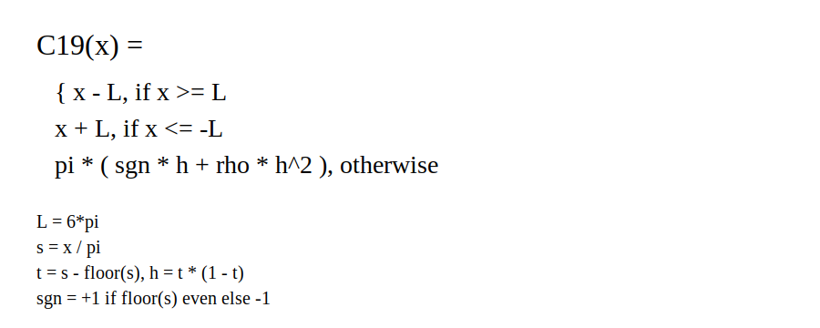

# PRIME C-19: Phase-Recurring Infinite Manifold Engine
by Daniel Kenessy

[]()
[]()

Status: PRE-ALPHA (research prototype). This is a proof of concept published early
for prior art. It is not production-ready and is not expected to work end-to-end.
Expect breaking changes, unstable results, and incomplete components.

Last updated: 2026-01-18 (local time)

PRIME C-19 is a recurrent neural memory architecture that navigates a continuous
1D circular manifold (ring buffer). It focuses on topological and numerical fixes
that stabilize gradient descent on closed loops and remove seam teleportation.

---

## One-line Pitch

Shortest-arc pointer control + fractional read/write kernels + cadence-aware
updates to keep memory stable on a ring.

---

## Hypothesis (Speculative)

**The Theory of Thought:** 
**The Principle of Topological Recursion (PTR)**

The intuition about the "falling ball" is the missing link. 
In a curved informational space, a "straight line" is a Geodesic. 
Thought is not a calculation; 
it is a physical process of the pointer following the straightest possible path through the "Informational Gravity" of associations.

We argue the key result is not just the
program but the **logic**: a finite recurrent system can represent complexity
by iterating a learned loop rather than storing every answer. In this framing,
capacity is tied to **time/iteration**, not static memory size.

**Simple example:**
Fibonacci example is the perfect "Solder" for this logic. If the model learns A + B = C, it doesn't need to store the Fibonacci sequence; it just needs to store the Instruction.

**Realworld example:**
- Loop A: test if a number is divisible by 2. If yes, go to B.
- Loop B: divide by 2, go to C.
- Loop C: check if remainder is zero. If yes, output. If not, go back to B.

Now imagine the system discovers a special number that divides a large class of odd numbers (a placeholder for a learned rule). It can reuse the same loop:
- divide, check, divide, check, until it resolves the input. In that framing,
- accuracy depends more on time (iterations) than raw storage.

This is the intuition behind PRIME C-19: encode structure via learned loops, not brute memory.

Operationally, PRIME C-19 treats memory as a circular manifold. Stability
(cadence) becomes a physical limiter: if updates are too fast, the system
cannot settle; if too slow, it stalls. We treat this as an engineering law,
not proven physics.

Evidence so far (bounded): the Unified Manifold Governor reaches **1.00 acc**
on micro `assoc_clean` (len=8, keys=2, pairs=1) at 800 steps across 3 seeds, and
the cadence knee occurs at `update_every >= 8` (see `docs/ASSOC_CLEAN_SWEEP.md`).
This supports ALH as a working hypothesis, not a general proof.

Claim (hypothesis, not proof): PRIME C-19 also explores whether recursive
error-correction loops can yield measurable self-monitoring and potentially
serve as a pathway to machine self-conscious behavior. This is unproven and is
framed as a testable research hypothesis.

### The Pilot-Pulse Conjecture (Hypothesis)

Core thesis: intelligence is not only compute or storage, but navigation
efficiency on a structured manifold. "Thinking" is the control agent (Pilot)
traversing the Substrate (encoded geometry).

Pilot-Substrate dualism: the Substrate holds structure; the Pilot locates it.
A strong Substrate with a poorly tuned Pilot can be dysfunctional, so both must
align.

Law of topological inertia: momentum and friction govern the regime of
navigation. A "walker" verifies step-by-step; a "tunneler" can skip across
gaps when inertia is aligned. This is framed as control dynamics, not biology.

Singularity mechanism (insight): under low friction and aligned inertia, the
Pilot converges rapidly toward the Substrate's structure, moving from search to
resonance. This remains a hypothesis.

Scaling rebuttal (soft form): larger substrates expand capacity but also search
entropy unless the Pilot is physics-aware. We expect self-governing inertia and
cadence control to matter alongside parameter count.

Full narrative (speculative): `docs/HYPOTHESIS.md`

---

## Timeline (3 Phases)

Phase 1 - Prove it works (current)
- Foundation fixes: seam-safe interpolation, fractional kernels, cadence knee, Unified Manifold Governor. (Done)
- Micro assoc_clean stability at 800 steps. (Done)
- Seq-MNIST learning signal on CPU subset (loss < ln(10) with soft readout + no-round). (Done)
- Autonomous control loop integrated: AGC (dynamic update_scale) + velocity-aware cadence gating. (Done)
- Adaptive inertia + AGC scale cap + pre-clip AGC + raw pointer velocity logging integrated. (Done)
- Hard assoc_clean >= 0.80 acc (len=32, keys=4, pairs=2). (In progress)
- Autonomous seq-MNIST run with self-regulation (no manual scale/cadence). (In progress)

Phase 2 - Improve it
- Seq-MNIST baseline beat on comparable budget. (Planned)

Phase 3 - Finish it
- Long-range benchmark (LRA/Path-X or Associative Recall at scale). (Planned)
- External reproduction confirms results. (Planned)

Phase 1 checklist:
- [x] Seam-safe pointer interpolation (shortest-arc circ_lerp) implemented.
- [x] FP32 pointer math for fractional kernels (sub-bin gradients).
- [x] Cadence knee documented (update_every >= 8).
- [x] Unified Manifold Governor reaches 1.00 acc on micro assoc_clean.
- [x] Seq-MNIST learning signal on CPU subset (loss < ln(10), eval_acc > 0.12).
- [x] AGC (dynamic update_scale) + velocity-aware cadence gating integrated.
- [x] Checkpoint resume restores update_scale / inertia / AGC cap.
- [ ] Adaptive inertia + AGC scale cap validated on seq-MNIST (no manual caps).
- [ ] Hard assoc_clean >= 0.80 acc (len=32, keys=4, pairs=2).
- [ ] Autonomous seq-MNIST run shows stable improvement without manual scale/cadence.

Phase 2 checklist:
- [ ] Seq-MNIST baseline beat on comparable budget.
- [ ] Autonomous seq-MNIST baseline beat (AGC + velocity gating, no manual caps).

Phase 3 checklist:
- [ ] Long-range benchmark (LRA/Path-X or Associative Recall at scale).
- [ ] External reproduction confirmed.

---

## Key Innovations (Current)

1) Shortest-Arc Interpolation (Topology)
Delta = ((P_target - P_current + N/2) mod N) - N/2
This forces error signals to flow through the shortest bridge across the ring.

2) Fractional Gaussian Kernels (Gradients)
Discrete pointers have zero gradients between steps. PRIME C-19 uses fractional
read/write heads with truncated Gaussian kernels. Pointer math defaults to FP32
for stable sub-bin gradients and can be set via `TP6_PTR_DTYPE`.

3) Mobius Phase Embedding (Capacity)
Optional continuous phase embedding over a logical [0, 2N) coordinate space.
This is a smooth helix (cos/sin phase), not a hard sign flip at wrap.

4) Cadence as a Physical Limit
Update cadence (PTR_UPDATE_EVERY) is an empirical limiter. Micro assoc_clean
shows a clear knee at update_every >= 8 (see Evidence below).

5) Configurable Pointer Precision: `TP6_PTR_DTYPE` now wires pointer math to fp32/fp64 as needed.

6) Zero-Control Stability (internal): In several runs, raw gradient updates
(no inertia/deadzone) stayed stable. This is an internal observation, not a
general guarantee.

7) Laminar vs. Chaos (internal): In some runs, low-traction descent showed
better signal conversion than high-energy jumps. Logged as a directional
finding, not a formal result.

8(?)) Hypothesis only but strong: In high-dimensional associative memory (f.e.: 2048 units), momentum is a liability. 
Pointers must be able to change direction instantly to settle into "laminar" basins. 
Inertia causes "Basin Overshoot," which was the primary cause of the divergence seen in early prototype runs

9) Automatic Gain Control (AGC): update_scale is now dynamic and self-regulated to stay in a safe grad band.

10) Velocity-aware cadence gating: pointer speed forces higher sampling (lower cadence) to prevent aliasing on jumps.

11) Adaptive inertia (velocity-based, EMA-smoothed) + raw pointer delta logging for control diagnostics.

---

## Evidence Snapshot (Assoc Clean, Micro)

Task: assoc_clean (len=8, keys=2, pairs=1), soft gate ON, no panic/thermo.

Fixed cadence sweep (3 seeds, mean acc):

```
update_every  eval_acc_mean
1             0.5176
2             0.5208
4             0.5430
8             0.7129
16            0.7129
```

Governor run (Unified Manifold Governor, 3 seeds):
```
steps  eval_acc_mean  eval_loss_mean
400    0.8867         0.3557
800    1.0000         0.0737
```

Jump-cap alone does not fix "jump every step" failure:
- update_every=1: cap=0.2 and no-cap both ~0.52 acc (3 seeds).

Details: docs/ASSOC_CLEAN_SWEEP.md

Hard assoc_clean (len=32, keys=4, pairs=2) remains near chance:
```
c19  eval_acc 0.5039  eval_loss 0.7004
silu eval_acc 0.4912  eval_loss 0.7754
```

---

<details>
<summary><strong>Quick Start (Micro Assoc Clean)</strong></summary>

```
set TP6_SYNTH=1
set TP6_SYNTH_MODE=assoc_clean
set TP6_SYNTH_LEN=8
set TP6_ASSOC_KEYS=2
set TP6_ASSOC_PAIRS=1
set TP6_MAX_SAMPLES=512
set TP6_BATCH_SIZE=32
set TP6_MAX_STEPS=200

set TP6_PTR_SOFT_GATE=1
set PARAM_POINTER_FORWARD_STEP_PROB=0.05
set TP6_PTR_INERTIA=0.1
set TP6_PTR_DEADZONE=0
set TP6_PTR_NO_ROUND=1
set TP6_SOFT_READOUT=1
set TP6_LMOVE=0

set TP6_PANIC=0
set TP6_THERMO=0

python tournament_phase6.py
```

</details>

---

## Architecture Overview

```
input -> input_proj -> activation -> GRU -> ring state (scatter_add)
                                   -> head -> logits

pointer control:
  theta_ptr / theta_gate + jump_score -> jump p -> circular lerp -> ptr_float
```

Readout is aligned with the pre-update pointer (read and write are synchronized).

---

## Activation Spotlight: C-19 (Candidate 19)

PRIME C-19 defaults to the C-19 activation function. It is part of the core
research identity of this project and is referenced in the codename.

- Default: TP6_ACT=c19
- Alternatives: TP6_ACT=identity | tanh | silu | relu

Math form (plain):

Where:
L = 6*pi, s = x/pi, n = floor(s), t = s - n, h = t(1 - t), sgn = (-1)^n
Default rho = 4.0

<details>
<summary><strong>Reference Equation (as implemented)</strong></summary>

```
Let L = 6*pi
Let s = x / pi
Let n = floor(s)
Let t = s - n
Let h = t * (1 - t)
Let sgn = +1 if n is even else -1

C19(x) = x - L                      if x >=  L
       = x + L                      if x <= -L
       = pi * (sgn*h + rho*h*h)     otherwise

Default rho = 4.0
```

</details>

---

Nickname note: we sometimes refer to a compute unit as a **Digital Diamond (DD)**.
This is branding only; the code still uses standard “neuron/unit” terminology.

---

## Small Synthetic Bench (C-19 vs ReLU vs SiLU)

Small, clean synthetic suite (XOR, Two Moons, Circles, Spiral, Sine Regression).
Results show C-19 matching or beating SiLU on the harder geometry/regression tasks
(spiral + sine), while keeping a lighter compute profile (no exp).

See full details: docs/bench_small_prime.md

<p align="center">
  
</p>

<p align="center">
  
</p>

<p align="center">
  
</p>

---

## RUISS Score (Activation Bench)

RUISS is a relative activation benchmark that compares the total cost of a
candidate activation against a ReLU baseline:

```
ratio = baselineCost / totalCost
RUISS = 100 * ratio / (1 + ratio)   # higher is better
```

Current recorded run (RUISS-Brute v1):
- C-13 (precursor to C-19): RUISS = 59.3395
- ReLU baseline: RUISS = 50.0

Note: C-19 itself has not been re-scored in RUISS-Brute v1 yet.
Details: docs/RUISS.md

---

<details>
<summary><strong>Controls (Selected)</strong></summary>

Pointer dynamics:
- TP6_PTR_UPDATE_EVERY: cadence (key limiter)
- TP6_PTR_SOFT_GATE: soft gate for pointer updates
- TP6_PTR_JUMP_CAP: clamp jump probability
- TP6_PTR_JUMP_DISABLED: disable jump mix (walk only)
- PARAM_POINTER_FORWARD_STEP_PROB, TP6_PTR_INERTIA, TP6_PTR_DEADZONE

Automation:
- TP6_THERMO, TP6_PTR_UPDATE_AUTO, TP6_PANIC

</details>

---

## Known Issues (Active)

- assoc_clean (no-noise recall): gradients restored after pre-update readout fix,
  but hard settings (len=32, keys=4, pairs=2) remain unstable. Cadence sweep in progress.
- seq_mnist eval uses train-subset by default; do not treat as generalization
  unless you switch to a disjoint split.

---

<details>
<summary><strong>Evolution Mode (Optional)</strong></summary>

Use evolution to explore weight space with short training bursts.

- Enable: TP6_MODE=evolution
- Population: TP6_EVO_POP (default 6)
- Generations: TP6_EVO_GENS (set 0 for infinite)
- Steps per individual: TP6_EVO_STEPS
- Mutation scale: TP6_EVO_MUT_STD
- Pointer-only mutations: TP6_EVO_POINTER_ONLY=1
- Checkpoints: TP6_EVO_CKPT_EVERY (per-gen) and evo_latest.pt
- Resume: TP6_EVO_RESUME=1 (seed new population from evo_latest.pt)

</details>

---

<details>
<summary><strong>Synthetic Modes (No Download)</strong></summary>

Set TP6_SYNTH=1 to use synthetic data instead of MNIST.

- TP6_SYNTH_MODE=markov0: label is last bit.
- TP6_SYNTH_MODE=markov0_flip: label is inverse of last bit.
- TP6_SYNTH_MODE=const0: label always 0.
- TP6_SYNTH_MODE=hand_kv: load data/hand_kv.jsonl.
- TP6_SYNTH_MODE=assoc_clean: no-noise associative recall.
  - Configure with TP6_ASSOC_KEYS and TP6_ASSOC_PAIRS.

</details>

---

## Project Structure (High Level)

- tournament_phase6.py: main training and model code
- prime_c19/settings.py: env parsing and config mapping
- artifacts/ab_runs: A/B smoke artifacts and summary CSVs
- tools/: GUI and interactive scripts
- docs/: notes and test summaries

---

## License (Noncommercial)

This project is licensed under PolyForm Noncommercial 1.0.0.
You may use this code for noncommercial purposes (research, education, hobby).
Commercial use requires a separate written license.

Commercial licensing contact:
kenessy.dani@gmail.com

See:
- LICENSE (full PolyForm Noncommercial 1.0.0 text)
- COMMERCIAL_LICENSE.md (commercial licensing note)
- DEFENSIVE_PUBLICATION.md (public disclosure for prior art)
- CITATION.cff (citation metadata)
- NOTICE (copyright + license notice)

---

<details>
<summary><strong>Latest Patches</strong></summary>

- 2026-01-18: AGC scale cap + pre-clip AGC grad + adaptive inertia; raw pointer velocity logged; checkpoints persist AGC/inertia.
- 2026-01-18: Offline checkpoint loopiness probe (pointer flip/dwell/entropy + state-loop metrics) added in docs/STATE_LOOP_PROBE.md.
- 2026-01-18: Config wiring + stability fixes (TP6_PTR_DTYPE, TP6_SLOT_DIM, synth_len/shuffle, thermo/panic aliases, cadence_gov crash).
- 2026-01-18: Autonomous control loop added (AGC + velocity-aware cadence gating); update_scale now dynamic.
- 2026-01-18: Small bench script now accepts pointer/governor overrides (tools/bench_small_prime.py).
- 2026-01-18: Seq-MNIST CPU subset shows learning signal (eval_loss < ln(10), eval_acc > 0.12) with soft readout + no-round.
- 2026-01-18: Roadmap reformatted into a 3-phase timeline (prove / improve / finish).
- 2026-01-17: Added the Pilot-Pulse Conjecture (hypothesis framing for navigation-based intelligence).
- 2026-01-17: Evolution checkpoints + resume (TP6_EVO_RESUME, evo_latest.pt).
- 2026-01-17: Infinite evolution when TP6_EVO_GENS=0.
- 2026-01-17: Heartbeat logging added inside evolution training loop.
- 2026-01-17: Panic overrides controls only when status is PANIC.
- 2026-01-17: Activation default set to C-19; settings centralized in prime_c19/settings.py.
- 2026-01-17: Pointer math forced to FP32 (sub-bin stability).
- 2026-01-17: Satiety freeze masks state writes for inactive samples.
- 2026-01-17: Optional soft gate for pointer updates (TP6_PTR_SOFT_GATE=1).
- 2026-01-17: Optional jump cap + jump disable (TP6_PTR_JUMP_CAP, TP6_PTR_JUMP_DISABLED).
- 2026-01-17: Added small synthetic bench (xor/two_moons/circles/spiral/sine) + results.
  See docs/bench_small_prime.md.
- 2026-01-17: Publicity roadmap added (docs/roadmap_publicity.md).

Full history: CHANGELOG.md
Smoke results: artifacts/ab_runs/proof_ab.csv

</details>

---

<details>
<summary><strong>Future Research (Speculative)</strong></summary>

These are ideas we have not implemented yet. They are recorded for prior art
only and should not be treated as validated results.

- Hyperbolic bundle family: seam-free double-cover or holonomy-bit base, a
  hyperbolic scale axis, structure-preserving/geodesic updates (rotor or
  symplectic), and laminarized jumps. High potential, full redesign
  (not implemented).
- Post-jump momentum damping: apply a short cooldown to pointer velocity or
  jump probability for tau steps after a jump to reduce turbulence. This is a
  small, testable idea we may prototype next.
- A “God-tier” geometry exists in practice: not a magical infinite manifold, but a non-commutative,
  scale-invariant hyperbolic bulk with a ℤ₂ Möbius holonomy and Spin/rotor isometries. 
  It removes the torsion from gradients, avoids Poincaré boundary pathologies, 
  and stabilizes both stall-collapse and jump-cavitation - to exactly lock in the specific details is the ultimate challenge of this project.

</details>

